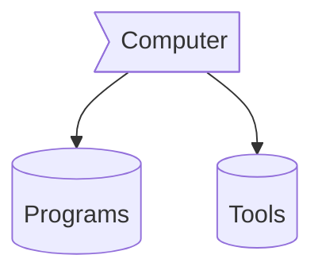

<div align = "center"><h1> Hello fellows! <a href="https://www.linkedin.com/in/serranor/"></a></h1></div>


<br />
<p align="center">

  
  
  
</p>

<p align="center">
<i>I am a <strong>Systems Engineer</strong> with a degree from the Universidad Metropolitana de Venezuela 💻 :venezuela:</i>
</p>

>"Since I didn't know it was impossible, I did it"
>  \- Albert Einstein

## A little about me 🦸🏻🌊
- Creating highly usable experiences with **Next.js** 🧑🏻‍💻
- Playing with the *3D world* with **Three.js** 🌐
- I keep improving my knowledge in *Typescript* focusing on **React** :electron:
- Ask me anything you want, if I can help you I will 💬
- Proudly Systems Engineer 🧑🏻‍🎓

## Technologies 

```mermaid
flowchart 
f1(HTML)
f2(Css)
f3(Typescript)
f4(Markdown)
fw1[React]
fw2[NextJs]
fw4[Tailwind]
fw5[Scss]
fw6[mermaid]
 subgraph Frameworks 
fw1
fw2
fw4
fw5
fw6
 end
  subgraph  FrontEnd 
 f1
 f2
 f3
 f4
 end  
 f1 --o f2
 f1 --o f3
 f1 --o f4
 f2 --> fw4
 f2 --> fw5
 f3 --o fw1
 f3 --o fw2
 f4 --> fw6
 ```

 
```mermaid
flowchart 
node{{NodeJs}}
rest{{RestAPIs}}
fb{{Firebase}}
nest{{NestJS}}
pst[("PostgreSQL")]
pg[("pgAdmin")]
docker[("Docker")]
 subgraph BackEnd
node
fb
rest
nest
pst
pg
 end
 node --o rest
 rest --o nest
 nest --o pst
 nest --o pg
 docker --o rest
```

## Find me at
- Gmail: <a href="mailto:ricardoserranodev@gmail.com">
    
  </a>
- Sharing information on <a href="https://www.linkedin.com/in/serranor/">
    
  </a> :briefcase:

<div align="center">
</div>

## Connect with me:
<p align="center">
<a href="https://linkedin.com/in/serranor" target="blank"></a>
<a href="https://instagram.com/_ricardoserrano" target="blank"></a>
<!-- <a href="https://stackoverflow.com/users/ricardoiso" target="blank"></a> -->
</p>
<p align="center">  </p>

## Dump space 👽




